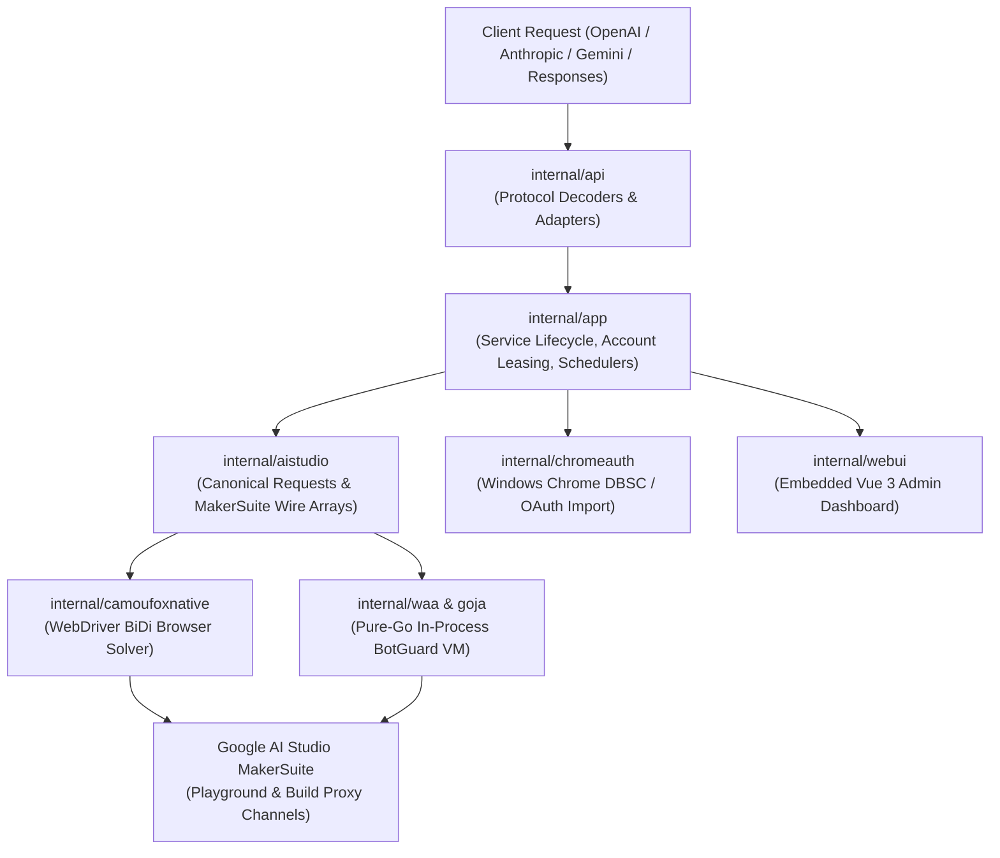

# AIStudio2API Agent Guide

This document serves as the primary technical guide for AI agents and developers working in the `AIStudio2API` repository. For in-depth guides and runbooks, refer to [`docs/agents/`](docs/agents/README.md).

---

## 1. Project Overview & Architecture

`AIStudio2API` is a high-performance Go proxy service that adapts Google AI Studio's internal MakerSuite web protocol into standard, fully compatible APIs:
- **OpenAI Chat Completions** (`/v1/chat/completions`, `/v1/models`)
- **OpenAI Responses API** (`/v1/responses`)
- **Anthropic Messages API** (`/v1/messages`, `/v1/messages/count_tokens`)
- **Gemini API** (`/v1beta/models/...:generateContent`, `:streamGenerateContent`, `:countTokens`, `:predictLongRunning`)
- **Realtime / Bidi & Robotics** (`/v1/live`, `/v1/robotics/stream`)
- **Media & Files** (`/v1/images/generations`, `/v1/audio/speech`, `/v1/audio/transcriptions`, `/v1/videos`, `/v1/files`)

### Core Architecture



- **Frontend (`web/`)**: Vue 3 + TypeScript + Vite + Tailwind CSS admin UI embedded into the Go binary via `internal/webui/embed.go`.
- **WAA Proof Generation (`internal/camoufoxnative/` & `internal/waa/`)**: Supports dual backends (`WAA_BACKEND=camoufox` or `go`):
  - **Camoufox**: Isolated headless browser via pure-Go WebDriver BiDi.
  - **Pure-Go**: In-process BotGuard VM running on an embedded SpiderMonkey-compatible `goja` engine simulating Firefox 152 DOM, requiring no browser process for request generation.
- **Dual Upstream Channels (`UPSTREAM_CHANNELS=playground,build`)**: Routes requests across independent quota pools on the same account (`playground` MakerSuite RPC and `build` application proxy).
- **Chrome OAuth / DBSC Import (`internal/chromeauth/`)**: Extracts Google credentials and Device Bound Session Credentials directly from local Chrome profiles on Windows.

---

## 2. Invariants & Repository Conventions

Every agent and contributor **must** adhere to these architectural invariants:

### A. English-Only Code & Logs
- All Go comments, documentation, log messages, error strings, and CLI output **must be in English** (refactor `eb81bd9`).
- Upstream commits from `Mag1cFall/AIStudio2API` often include Chinese comments and error strings. When porting or merging upstream changes, **always translate them to concise English**.
- Chinese is permitted *only* in user-facing i18n translation files (`web/src/i18n.ts`) and localized documentation (`README.md`, `docs/`).

### B. Immutable Runtime Configuration (Docker-Safe)
- Configuration is **strictly read-only at runtime** (refactor `6e318e0`).
- The proxy loads its configuration once upon startup from environment variables and `.env`.
- Do **not** re-introduce mutable configuration endpoints (`PUT /api/config`), runtime `.env` writes, or dynamic reloading mechanisms that mutate disk files.
- The web UI Settings panel functions as a read-only configuration inspector.

### C. Chrome Import by Account ID
- Upstream supports importing multiple distinct Google accounts from a single Chrome Profile.
- Accounts are identified by `ID: "<Profile>/<GaiaID>"`.
- API and CLI use `AccountIDs []string` / `account_ids`, not profile names.

### D. Single-Direction Data Flow & Clean Separation
- `internal/api/` handles external protocol serialization/deserialization. It does not touch raw Camoufox processes, disk locks, or low-level account leases directly.
- `internal/aistudio/` contains wire encoders/decoders for Google's internal array format and account structures.
- `internal/app/` coordinates business logic, service restart/start lifecycle, account leasing, and scheduling policies.
- `cmd/aistudio2api/` remains a thin entry point delegating to `app.Run()`.

### E. Branch Documentation & Dev Merge Logging
- **Branch Document**: For any feature, refactoring, or sync branch, create a documentation file in `docs/branches/<branch-name>.md` using `docs/branches/_template.md` as the template.
- **Merge Logging in `_dev.md`**: Whenever a branch or set of changes is merged into `dev`, **must** add a new entry to `docs/branches/_dev.md` (Date, Commit hash, Author, Source Branch, and bulleted summary of changes) and update `docs/branches/_index.md` status to `Merged into dev`.
---

## 3. Directory Layout

```text
AIStudio2API/
├── cmd/
│   └── aistudio2api/          # Application entry point
├── internal/
│   ├── aistudio/              # Google MakerSuite wire protocol, RPC client, account pool
│   ├── api/                   # OpenAI, Anthropic, Gemini, Responses, Admin HTTP routes
│   ├── app/                   # Runtime management, lifecycle, account leases, scheduling
│   ├── camoufoxnative/        # WebDriver BiDi client, Camoufox process, WAA proof solver
│   ├── chromeauth/            # Windows Chrome OAuth / DBSC decryption and token service
│   ├── config/                # Environment and configuration loading (read-only)
│   ├── setup/                 # Interactive CLI setup and account onboarding
│   ├── waa/                   # Pure-Go BotGuard VM runtime, Firefox 152 DOM, Goja fork
│   └── webui/                 # Go embed for built frontend assets (dist/)
├── web/                       # Vue 3 admin dashboard source
├── docs/                      # Technical documentation and protocol specifications
├── legacy/                    # Historical documentation and branch tracking
├── auth/                      # Account storage directory (git-ignored)
└── .codegraph/                # CodeGraph symbol index (git-ignored)
```

---

## 4. Git Branching Strategy

| Branch | Description | Policy |
|---|---|---|
| `upstream-main` | Mirrors upstream `Mag1cFall/AIStudio2API:main` | Fast-forward only. Never commit local modifications here. |
| `dev` | Main development branch of this fork | Active branch containing English refactor and read-only config. |
| `sync/*` | Upstream synchronization branches | Used to merge `upstream-main`, resolve conflicts, and adapt code. |
| `feature/*` / `fix/*` | Feature and bugfix branches | Branch from `dev` and merge back into `dev`. |

---

## 5. Development & Verification Commands

### Backend (Go)
```powershell
# Run all tests
go test ./...

# Run static analysis
go vet ./...

# Build all packages
go build ./...

# Run service locally
go run ./cmd/aistudio2api --listen 127.0.0.1:2048 --open-ui
```

### Frontend (Vue 3 / TypeScript)
```powershell
cd web

# Install dependencies
npm ci

# Typecheck
npm run typecheck

# Build for production (outputs to internal/webui/dist/)
npm run build

# Lint and format
npm run lint
npm run format:check
```

*Note: Before compiling Go binaries or running end-to-end tests, make sure `web/` has been built (`npm run build`), as `internal/webui/embed.go` embeds `internal/webui/dist/`.*

---

## 6. Checklists for Modifying Code

- [ ] **Comments & Errors**: Are all new/edited comments and error strings in English?
- [ ] **Config Invariant**: Does the change avoid modifying `.env` or configuration at runtime?
- [ ] **Types & Tests**:
  - `go test ./...` passes without errors.
  - `go vet ./...` reports 0 issues.
  - `npm --prefix web run typecheck` passes without errors (if frontend touched).
- [ ] **Protocols**: If modifying upstream AI Studio wire encoding/decoding, verify array indexing rules (`field N` corresponds to index `N-1`).
- [ ] **Branch Documentation**: Is the branch documented in `docs/branches/`? If merging into `dev`, is `docs/branches/_dev.md` updated?
