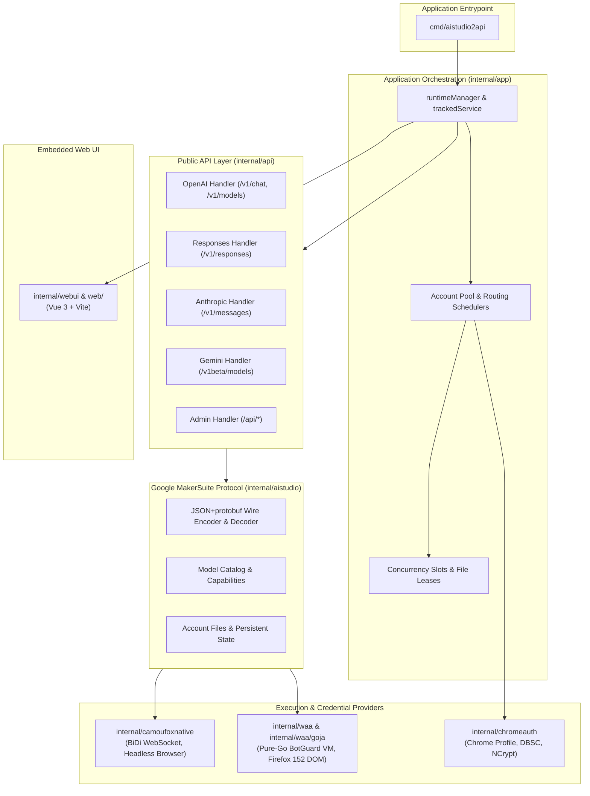
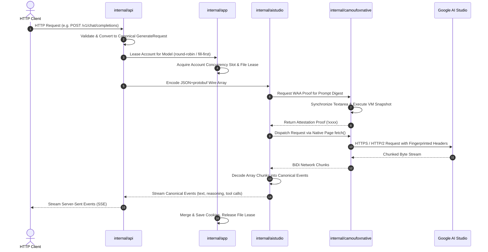

# Architecture & System Design

This document details the internal design, component responsibilities, concurrency model, and request lifecycles of `AIStudio2API`.

---

## 1. System Components & Separation of Concerns

### Component Roles

| Package | Purpose |
|---|---|
| `cmd/aistudio2api` | Minimal main entry point. Parses CLI flags and hands control over to `app.Run()`. |
| `internal/app` | Coordinates the generation service lifecycle (`Start`/`Stop`), active request registry, worker concurrency semaphores, file-based leasing, and account pool management. |
| `internal/api` | Implements HTTP routes and WebSocket handlers for OpenAI, Anthropic, Gemini, Responses, and administrative management APIs. Converts external API DTOs into canonical types. |
| `internal/aistudio` | Core Google MakerSuite protocol layer. Encodes canonical requests into raw protobuf-like JSON arrays, decodes upstream SSE/WebChannel chunks into canonical events, and manages account persistent files. |
| `internal/camoufoxnative` | Controls headless Camoufox instances via pure-Go WebDriver BiDi. Provides browser-based WAA challenge execution, cookie/state extraction, and automated Google Drive consent. |
| `internal/waa` & `goja` | Pure-Go WAA runtime executing official BotGuard interpreter, dynamic programs, and snapshot proofs in-process on an embedded Goja JS engine simulating Firefox 152 DOM. |
| `internal/chromeauth` | Decrypts and imports Google OAuth refresh tokens and Device Bound Session Credentials (DBSC) from Windows Google Chrome installations. |
| `internal/config` | Reads, validates, and exposes runtime configuration from environment variables and `.env` in an immutable, read-only manner. |
| `internal/setup` | Implements CLI onboarding wizard commands (`aistudio2api setup`). |
| `internal/webui` | Embeds the compiled Vue 3 distribution (`internal/webui/dist/`) via `embed.FS`. |

---

## 2. End-to-End Request Flow

A typical request (e.g. `POST /v1/chat/completions`) follows this sequence:

### Dual Upstream Quota Channels (Playground & Build)

`AIStudio2API` supports two independent upstream channels on every account (`UPSTREAM_CHANNELS=playground,build`):
1. **Playground Channel (`playground`)**: Uses Google AI Studio's direct MakerSuite RPC endpoints (`GenerateContent`, `CreateInteractionStream`, WebChannel).
2. **Build Channel (`build`)**: Uses the Build application's proxy protocol (`ProxyStreamedCall` for streaming and `ProxyUnaryCall` for unary calls), accessing an independent quota tier for the same account.

When both channels are enabled, the scheduler treats `(Account, Channel)` tuples as separate candidates. If an account's Playground quota enters cooldown, requests for that account immediately spill over to its Build channel (and vice-versa).

---

## 3. Account Storage & Persistence Architecture

Each account is stored under `auth/<Google Email>/` with four distinct files:

| File | Content | Lifecycle |
|---|---|---|
| `account.json` | Account metadata (`label`, `enabled`, `proxy`, `locale`, `timezone`). | Written on account creation or edit. Serves as the commit point for account configuration. |
| `storage-state.json` | Playwright storage state format (Cookies, localStorage, and optional Chrome OAuth renewal material). | Atomically merged and updated when upstream returns `Set-Cookie` or after token renewal. |
| `camoufox-fingerprint.json` | Account-pinned hardware and browser fingerprint (navigator, screen, fonts, timezone). | Generated once per account; reused for all subsequent sessions. |
| `runtime-state.json` | Discovered benefit tier, validated model access statuses, cooldown timers, and Drive/Veo resource IDs. | Atomically updated under a short-transaction lock during execution. |

### Lock Hierarchy

1. **Long-Running Request Lease Lock** (`auth/.leases/<email>.lock`):
   - Held while an account is executing requests. Prevents cross-process over-allocation.
2. **Short-Transaction State Lock** (`auth/.leases/<email>.runtime.lock`):
   - Held for milliseconds during read-modify-write operations on `runtime-state.json`.

---
3. **Per-Account Browser Cache (`auth/<email>/camoufox-cache/`)**:
   - Dedicated HTTP disk cache directory per account with `.lock` file to prevent concurrent access conflicts.
4. **Automated Google Drive Consent**:
   - Automates OAuth consent for Google Drive during login onboarding (`internal/camoufoxnative/drive.go`), ensuring access to Drive-hosted files and attachments.

## 4. WAA Runtime Backends & Warm Pool Management

### Backend Selection (`WAA_BACKEND`)

The proxy supports two alternative WAA backends for generating attestation proofs:

1. **`camoufox` (Default Browser Backend)**:
   - **Worker (`internal/camoufoxnative/worker.go`)**: An active, isolated headless Camoufox browser session dedicated to an account.
   - **Warm Pool (`WARM_WORKER_LIMIT`)**: Pre-bootstrapped background instances kept running for instant proof generation.
   - **Max Workers (`MAX_ACTIVE_WORKERS`)**: Hard limit on total concurrent browser instances.
   - **Recycling Strategy**: Graceful hot-swap replaces least-recently-used idle workers when capacity is reached.

2. **`go` (Pure-Go In-Process VM Backend)**:
   - Runs Google's official BotGuard interpreter, challenge script, and snapshot proofs **inside the Go process** via a specialized SpiderMonkey-compatible `goja` JavaScript runtime (`internal/waa/`).
   - Eliminates the need to download, launch, or manage Camoufox browser processes for request generation.
   - Emulates Firefox 152 DOM and SpiderMonkey object property ordering (`global_order.go`).
   - Dispatches protected requests directly over a persistent HTTP/2 connection with account-pinned egress.
   - *Note*: An on-demand Camoufox instance is only invoked if an interactive or automated account login is performed.
